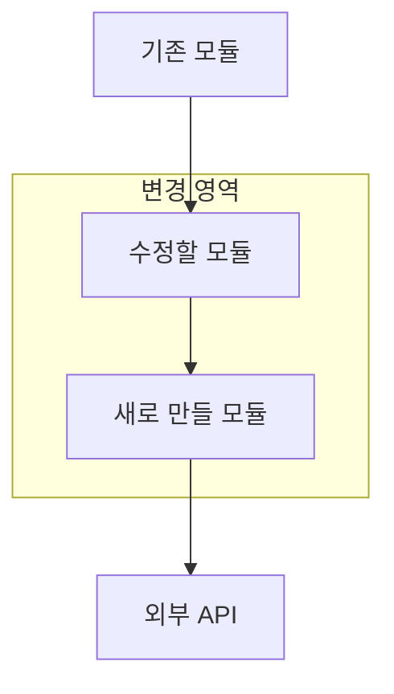
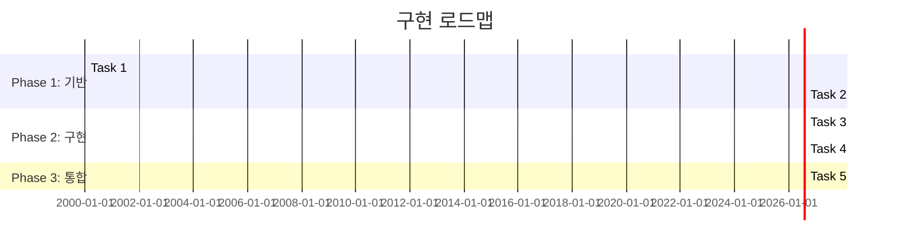
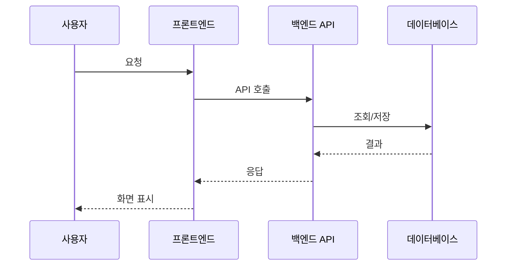

# /auto - 원스톱 자동 워크플로우 (v7)

개별 커맨드를 하나씩 호출하는 대신, 전체 파이프라인을 한 번에 자동 실행합니다.

---

## IRON RULE: 필수 단계 규칙 (절대 위반 불가)

```
[1~4단계]   필수 자동 진행 — 스킵 불가, 예외 없음
[4.5단계]   자동 저장 — save-progress로 작업 상태 자동 보존
[5~7단계]   사용자 확인 후 진행 — 반드시 물어보고 승인 시에만 실행
```

### 필수 단계 (1~4): 무조건 전부 실행
- Plan → TDD → Code Review → Verify 순서로 **반드시 전부** 실행한다.
- 어떤 이유로든 1~4단계를 건너뛸 수 없다.
- "간단한 작업이라 스킵", "이미 테스트가 있으니 스킵" 등의 이유는 인정하지 않는다.
- 1~4단계 중 하나라도 실패하면 실패 보고 후 중단한다. 5~6단계로 넘어가지 않는다.

### 선택 단계 (5~7): 사용자 확인 필수
- 4단계(Verify)까지 완료 후, 사용자에게 결과를 보여주고 묻는다:
  - "커밋 & PR을 생성하시겠습니까?"
  - "문서 동기화를 진행하시겠습니까?"
  - "이번 작업 내용을 메모리에 저장하시겠습니까?"
- 사용자가 거부하면 해당 단계를 스킵한다.
- 사용자가 승인하면 실행한다.

CRITICAL 보안 이슈 발견 시에만 1~4단계에서도 즉시 중단한다.

---

## 0단계: 인자 파싱

$ARGUMENTS에서 옵션을 추출한다:

| 인자 | 기본값 | 설명 |
|------|--------|------|
| `--mode` | feature | 실행 모드: feature / bugfix / refactor |
| 나머지 텍스트 | - | 작업 설명 (필수) |

작업 설명이 없으면 에러를 출력하고 종료한다:

```
사용법: /auto [작업 설명]

예시:
  /auto 로그인 페이지 만들기
  /auto --mode bugfix 결제 금액이 0원으로 표시되는 버그
  /auto --mode refactor 인증 모듈 정리
```

---

## 1단계: 모드별 파이프라인 결정

### feature 모드 (기본)

```
[필수] plan -> tdd -> dual-review -> handoff-verify -> save-progress -> [확인] commit-push-pr -> sync-docs -> memory
```

1. **[필수] plan**: `superpowers:writing-plans` 스킬로 구현 계획 수립 (실행 핸드오프 없이 계획만). 사용자 확인 없이 자동 확정.
2. **[필수] tdd**: 테스트 먼저 작성 후 구현. RED -> GREEN -> IMPROVE 사이클.
3. **[필수] dual-code-review**: 2중 코드 리뷰 (아래 "Dual Code Review 프로세스" 참조).
4. **[필수] handoff-verify**: 빌드/테스트/린트 자동 검증. 실패 시 자동 수정 후 재검증 (최대 5회).
4.5. **[자동] save-progress**: 필수 단계 완료 상태를 자동 저장. 세션 중단 시 `/resume-work`로 복구 가능.
5. **[확인] commit-push-pr**: 사용자 승인 후 커밋 메시지 자동 생성, 푸시, PR 생성.
6. **[확인] sync-docs**: 사용자 승인 후 프로젝트 문서 동기화.
7. **[확인] memory**: 사용자 승인 후 이번 작업 내용을 메모리에 저장 (아래 "Memory 저장 프로세스" 참조).

### bugfix 모드

```
[필수] explore -> tdd -> handoff-verify -> save-progress -> [확인] quick-commit -> sync-docs -> memory
```

1. **[필수] explore**: 관련 코드 탐색으로 버그 원인 파악.
2. **[필수] tdd**: 버그를 재현하는 테스트 작성 후 수정.
3. **[필수] handoff-verify**: 빌드/테스트 검증 (--once 모드).
3.5. **[자동] save-progress**: 필수 단계 완료 상태를 자동 저장.
4. **[확인] quick-commit**: 사용자 승인 후 자동 생성된 커밋 메시지로 빠른 커밋 + 푸시.
5. **[확인] sync-docs**: 사용자 승인 후 프로젝트 문서 동기화.
6. **[확인] memory**: 사용자 승인 후 이번 버그 수정 내용을 메모리에 저장.

### refactor 모드

```
[필수] refactor-clean -> dual-review -> handoff-verify -> save-progress -> [확인] commit-push-pr -> sync-docs -> memory
```

1. **[필수] refactor-clean**: 사용하지 않는 코드, 중복 제거, 구조 개선.
2. **[필수] dual-code-review**: 2중 코드 리뷰 (아래 "Dual Code Review 프로세스" 참조).
3. **[필수] handoff-verify**: 기존 기능이 깨지지 않았는지 검증.
3.5. **[자동] save-progress**: 필수 단계 완료 상태를 자동 저장.
4. **[확인] commit-push-pr**: 사용자 승인 후 커밋 + PR (--squash 권장).
5. **[확인] sync-docs**: 사용자 승인 후 프로젝트 문서 동기화.
6. **[확인] memory**: 사용자 승인 후 이번 리팩토링 내용을 메모리에 저장.

---

## 2단계: 환경 확인 및 자동 세팅

파이프라인 시작 전 기본 환경을 확인하고, 누락된 것이 있으면 **자동으로 세팅**한다.
특정 프로젝트에 종속되지 않는 글로벌 스킬이므로, 어떤 프로젝트에서든 동작해야 한다.

#### 2-1. Git 확인 및 초기화
```bash
git rev-parse --is-inside-work-tree 2>/dev/null
```
- 있으면: 그대로 진행
- 없으면: 사용자에게 `git init` 여부를 묻고, 승인 시 초기화 + `.gitignore` 생성 + 초기 커밋

#### 2-2. 프로젝트 타입 감지
- Python: `requirements.txt` / `pyproject.toml` / `setup.py`
- Node.js: `package.json`
- Go: `go.mod`
- Rust: `Cargo.toml`
- 감지 불가: 사용자에게 프로젝트 타입을 묻는다

#### 2-3. 테스트 프레임워크 확인
| 프로젝트 타입 | 확인 대상 | 없으면 |
|---|---|---|
| Python | `pytest` import 가능 여부 | "pytest 설치하시겠습니까?" |
| Node.js | `jest` / `vitest` in devDependencies | "테스트 프레임워크 설치하시겠습니까?" |
| Go | 기본 내장 | 항상 사용 가능 |

#### 2-4. 린트 확인
| 프로젝트 타입 | 확인 대상 | 없으면 |
|---|---|---|
| Python | `ruff` or `flake8` | "ruff 설치하시겠습니까?" |
| Node.js | `eslint` in devDependencies | "eslint 설치하시겠습니까?" |
| Go | `golangci-lint` | 안내만 제공 |

#### 2-5. 패키지 매니저 감지
- pnpm-lock.yaml → pnpm
- yarn.lock → yarn
- bun.lockb → bun
- package-lock.json / 기본 → npm
- requirements.txt → pip

**모든 환경 확인은 사용자에게 물어본 후 진행한다. 강제 설치하지 않는다.**

---

## 3단계: 파이프라인 실행

각 단계를 순차적으로 실행한다.
ultrawork 모드를 사용하여 중간에 멈추지 않는다.

### 단계 전환 규칙

#### 필수 단계 (1~4): 자동 연속 진행
- 각 단계 완료 후 즉시 다음 단계로 진행한다.
- 사용자 확인을 요청하지 않는다.
- 어떤 단계도 스킵할 수 없다. "이미 테스트 있음", "간단한 변경" 등의 이유로 스킵 불가.
- CRITICAL 보안 이슈 발견 시에만 중단하고 사용자에게 보고한다.

#### 선택 단계 (5~7): 사용자 확인 필수
- 4단계 완료 후 결과를 요약하여 사용자에게 보여준다.
- 다음을 명시적으로 묻는다:
  - "커밋 & PR을 생성하시겠습니까? (Y/N)"
  - "문서 동기화를 진행하시겠습니까? (Y/N)"
  - "이번 작업 내용을 메모리에 저장하시겠습니까? (Y/N)"
- 사용자가 거부하면 해당 단계를 SKIP 처리한다.
- 사용자가 승인해야만 실행한다.

### plan 단계: `superpowers:writing-plans` 스킬 사용 (feature 모드)

Plan 단계는 반드시 `superpowers:writing-plans` 스킬을 호출하여 실행한다.
일반 `/plan` 커맨드가 아니라, 스킬 기반의 구조화된 계획 수립을 따른다.

1. `superpowers:writing-plans` 스킬을 호출한다.
2. 스킬이 제공하는 구조화된 계획 프로세스를 따른다.
   - 파일 구조 매핑, bite-sized 태스크 분해, TDD 기반 단계 설계
   - 모든 단계에 실제 코드 블록, 정확한 파일 경로, 실행 명령어 포함
   - placeholder 금지 (TBD, TODO 등 불허)
   - 셀프 리뷰 (spec 대비 누락 체크, 타입 일관성 검증)
3. 아래 **시각 문서**를 플랜에 반드시 포함한다.
4. 계획을 `docs/superpowers/plans/` 에 저장하고 출력한다.

#### 플랜 필수 시각 문서 (Plan Visual Documents)

플랜에는 코드 태스크 외에 다음 3가지 시각 문서를 **반드시** 포함한다.
Mermaid 문법으로 작성하여 마크다운에서 바로 렌더링 가능하게 한다.

**1. 아키텍처 다이어그램 (Architecture Diagram)**
- 시스템 구성 요소 간 관계를 보여주는 다이어그램
- 프론트엔드, 백엔드, DB, 외부 API 등 컴포넌트 간 데이터 흐름
- 이번 작업에서 수정/추가되는 부분을 명시적으로 표시



**2. 구현 로드맵 (Implementation Roadmap)**
- 태스크 간 의존 관계와 실행 순서를 시각화
- 병렬 가능한 작업과 순차 필수 작업을 구분
- 예상 소요 시간 (bite-sized 단위)



**3. 데이터 플로우 다이어그램 (Data Flow)**
- 사용자 입력부터 최종 출력까지의 데이터 흐름
- 각 단계에서 데이터가 어떻게 변환되는지 표시
- 에러 처리 경로 포함



#### /auto 모드 제한 사항 (CRITICAL)
- **실행 핸드오프를 하지 않는다.** 스킬이 "Subagent-Driven vs Inline Execution" 선택을 제안하면 무시한다.
- `superpowers:subagent-driven-development`, `superpowers:executing-plans`를 호출하지 않는다.
- **계획 수립까지만 진행**하고, 실행은 `/auto`의 2단계(TDD)부터 `/auto` 파이프라인이 담당한다.
- 사용자 확인 없이 자동 확정하고 다음 단계로 진행한다.

### dual-code-review 단계: Dual Code Review 프로세스

Code Review 단계에서는 **2개의 독립적인 리뷰**를 병렬 실행하고 결과를 비교한다.

#### 실행 순서

```
[병렬 실행]
  ├── Review A: `/code-review` 스킬 (보안 + 품질 검사)
  └── Review B: `/codex:review` 스킬 (Codex 기반 독립 리뷰)
        ↓
[비교 & 통합]
  → 두 리뷰 결과를 대조하여 합리적 결론 도출
        ↓
[자동 수정]
  → CRITICAL/HIGH 이슈 자동 수정
```

#### 비교 & 통합 규칙

1. **양쪽 모두 지적한 이슈**: 확정 이슈 → 즉시 수정
2. **한쪽만 지적한 이슈**: 해당 이슈를 코드에서 직접 확인 후 판단
   - 실제 문제가 맞으면 수정
   - 오탐(false positive)이면 무시하고 이유를 기록
3. **양쪽의 해결 방안이 다른 경우**: 프로젝트 컨벤션과 설계 문서에 부합하는 쪽을 채택
4. **결과 출력**: 두 리뷰의 이슈 수, 일치/불일치 항목, 최종 판단을 요약 출력

```
[Dual Code Review 결과]
  Review A (code-review):   CRITICAL 0 / HIGH 1 / MEDIUM 3
  Review B (codex):         CRITICAL 0 / HIGH 2 / MEDIUM 1
  ─────────────────────────────────────────────────
  일치 이슈:    HIGH 1건, MEDIUM 1건 → 확정 수정
  Review A만:   MEDIUM 2건 → 검증 후 1건 수정, 1건 오탐
  Review B만:   HIGH 1건 → 검증 후 수정
  최종:         CRITICAL 0 / HIGH 2 / MEDIUM 2 수정 완료
```

### 에러 처리

- **Fixable 에러** (린트, import, 타입 단순 오류): 자동 수정 후 계속 진행.
- **Non-fixable 에러** (로직 오류, 아키텍처 문제): 해당 단계에서 최대 3회 재시도 후 실패 보고.
- **CRITICAL 보안 이슈**: 즉시 중단, 사용자에게 보고.

### memory 단계: Memory 저장 프로세스

사용자 승인 시, 이번 `/auto` 작업에서 발생한 비자명(non-obvious) 정보를 메모리에 저장한다.
Claude Code의 auto memory 시스템(`~/.claude/projects/.../memory/`)을 사용한다.

#### 저장 대상 (코드에서 직접 읽을 수 없는 것만)

| 유형 | 예시 |
|------|------|
| project | "인증 모듈을 JWT → 세션 기반으로 전환. 이유: 모바일 앱 호환성" |
| feedback | "이 프로젝트에서는 Supabase RLS 대신 백엔드 미들웨어로 권한 체크" |
| project | "2026-04-09 블로그 이미지 생성 모듈에 Gemini fallback 추가" |

#### 저장하지 않는 것

- 파일 경로, 함수명, 코드 패턴 (코드를 읽으면 알 수 있음)
- Git 히스토리로 확인 가능한 정보
- 이미 CLAUDE.md에 기록된 내용

#### 실행 방법

1. 이번 작업의 핵심 의사결정/맥락을 1~3개로 요약
2. 사용자에게 저장할 내용을 보여주고 확인
3. 승인 시 적절한 type(project/feedback/reference)으로 메모리 파일 작성
4. MEMORY.md 인덱스 업데이트

---

## 4단계: 결과 요약

전체 파이프라인이 완료되면 한 번에 요약을 출력한다:

### 성공 시

```
======================================================================
  Auto Complete (v7) - [mode] 모드
======================================================================

  작업: [작업 설명]

  실행 결과 (필수 단계):
    [1] Plan              DONE   superpowers:writing-plans | [N]개 단계 계획
    [2] TDD               DONE   [N]개 테스트, [N]% 커버리지
    [3] Dual Code Review  DONE   code-review: C0/H0 | codex: C0/H1 | 최종: C0/H0
    [4] Verify            PASS   빌드+테스트+린트 통과
    [4.5] Save Progress   AUTO   작업 상태 자동 저장 완료

  사용자 확인 단계:
    [5] Commit & PR       DONE   PR #[번호]: [URL]
    [6] Sync Docs         DONE   문서 동기화 완료
    [7] Memory            DONE   project 1건 저장

======================================================================
```

### 부분 실패 시

```
======================================================================
  Auto Incomplete (v7) - [mode] 모드
======================================================================

  작업: [작업 설명]

  실행 결과 (필수 단계):
    [1] Plan              DONE   superpowers:writing-plans
    [2] TDD               DONE
    [3] Dual Code Review  WARN   code-review: H1 | codex: H2 | 일치 H1, 수정 H2
    [4] Verify            FAIL   테스트 2개 실패
    [4.5] Save Progress   AUTO   작업 상태 자동 저장 완료

  사용자 확인 단계:
    [5] Commit & PR       SKIP   (검증 실패로 스킵)
    [6] Sync Docs         SKIP   (커밋 실패로 스킵)
    [7] Memory            SKIP   (커밋 실패로 스킵)

  실패 상세:
    - src/auth.ts:45 - 타입 불일치 (자동 수정 실패)
    - src/auth.test.ts:30 - 예상값 불일치

  수동 수정 후:
    /handoff-verify -> /commit-push-pr

======================================================================
```

---

## 사용 예시

```bash
# 새 기능 (기본 모드)
/auto 로그인 페이지 만들기

# 버그 수정
/auto --mode bugfix 결제 금액이 0원으로 표시되는 버그

# 코드 정리
/auto --mode refactor 인증 모듈 정리

# 자연어로 작업 설명
/auto 사용자가 비밀번호를 5번 틀리면 계정을 10분 잠금하는 기능
/auto --mode bugfix 이미지 업로드 시 CORS 에러
/auto --mode refactor API 호출 로직을 커스텀 훅으로 분리
```

---

## 주의사항

- `/auto`는 각 단계의 세부 동작을 개별 커맨드(`/plan`, `/tdd` 등)에 위임합니다.
- 중간 과정이 모두 출력되므로 진행 상황을 실시간으로 확인할 수 있습니다.
- CRITICAL 보안 이슈 외에는 멈추지 않으므로, 민감한 작업은 개별 커맨드를 사용하세요.
- 각 단계를 더 세밀하게 제어하고 싶다면 개별 커맨드를 순서대로 사용하세요.
